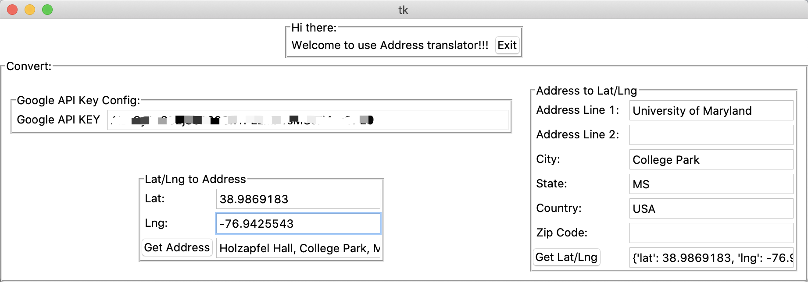

# Google_Location

 Google_Location_App

## Info:
- This is a simple python app using Google Map API to translate Address to Lag/Lng Translation or reverse.

## Memo:
- if you don't have a Google API key yet, you could get one from [here](https://developers.google.com/maps/documentation/geocoding/get-api-key)
- currently, the app will only fetch the best match (the first result)
- next step: error handler

## Background: 
- Recently, for one of my school projects, I have to heavily use Google Map API.During the development, to debug and to validate some results, I have to repeatedly translate the Address to Lat/Lng or from Lat/Lng to human-readable strings.

- To speed up the process, I designed this tool with a graphical user interface (GUI). The GUI system is depended on Tkinter, which is a standard package that comes with Python.

- I found Tkinter is very handy, especially when you wish to have some tool kits to speed up your daily work or you want to distribute some tools kits for the user who are not very familiar with coding.

- This project is still in the naive stage. I am also learning and exploring the power of Tkinter. I will keep working on this tool and summarize my discovery or understanding of Tkinter in this doc.
- If I find any useful articles or tutorials, I will also update that in this doc. If you have any cool ideas or interesting features that want to add to this tool, please don't hesitate to let me know.
